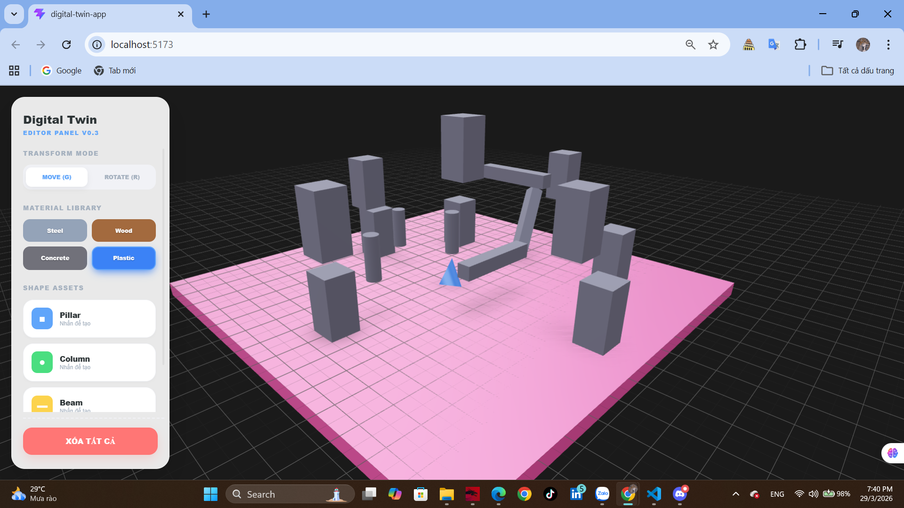
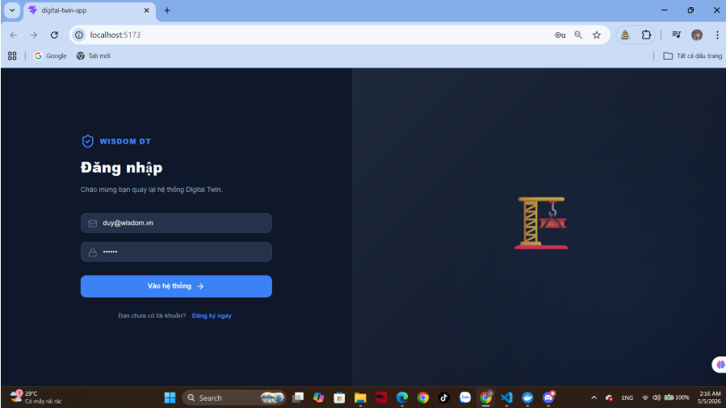
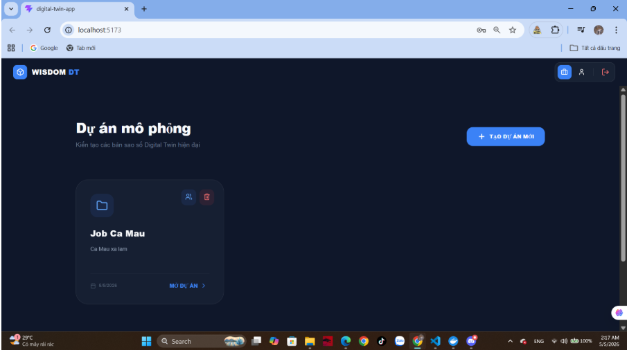
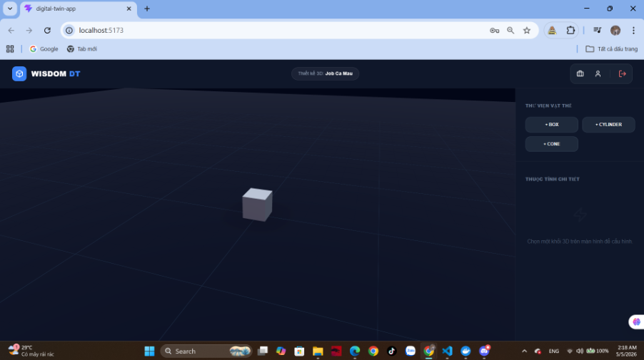

# 🏗️ Digital Twin App - Construction Editor

Dự án mô phỏng không gian số - thử nghiệm (Digital Twin - test) hỗ trợ biên soạn và quản lý các cấu kiện xây dựng trong môi trường 3D tương tác thời gian thực.

-----

## 🛠️ Công nghệ & Thư viện sử dụng

| Thư viện | Vai trò |
| :--- | :--- |
| **React + Vite** | Framework chính, tối ưu tốc độ phản hồi HMR. |
| **Three.js** | Core engine xử lý đồ họa WebGL. |
| **@react-three/fiber** | Render Three.js bằng cú pháp React component. |
| **@react-three/drei** | Thư viện bổ trợ (Grid, TransformControls, Environment, ContactShadows). |
| **Zustand** | Quản lý trạng thái (State Management) tập trung và đồng bộ dữ liệu. |
| **Axios** | Thực hiện các yêu cầu HTTP (API calls) tới cổng Gateway. |
| **Lucide React** | Bộ thư viện icon vector cao cấp cho giao diện người dùng. |

-----

## Kiến trúc Hệ thống (Microservices)

Ứng dụng tương tác với hệ thống Backend gồm 6 dịch vụ cốt lõi:

* **Auth Service:** Quản lý đăng nhập, đăng ký, bảo mật JWT và hồ sơ người dùng.
* **Project Service:** Quản lý danh sách, thông tin và môi trường của các dự án.
* **Project Member Service:** Phân quyền và quản lý nhân sự (ADMIN, EDITOR, VIEWER).
* **Element Service:** Lưu trữ thông tin định danh và tọa độ (Transform) của khối 3D.
* **Element Detail Service:** Quản lý chi tiết từng mặt (Face) và tỷ lệ của cấu kiện.
* **Material Service:** Thư viện vật liệu (Thép, Gỗ, Bê tông...) áp dụng cho cấu kiện.

## 💡 Các phương pháp & Chức năng chính

### 1\. Quản lý dữ liệu tập trung (Zustand Store)

Toàn bộ thông tin về vị trí (`position`), góc xoay (`rotation`), loại hình dạng (`geometry`) và vật liệu (`materialId`) được lưu trữ tập trung. Điều này giúp đồng bộ dữ liệu giữa bảng điều khiển UI và không gian 3D.

### 2\. Tương tác vật thể (Transform Gizmo)

Sử dụng phương pháp **TransformControls** để cung cấp các mũi tên điều hướng. Người dùng có thể:

  * **Move Mode (G):** Di chuyển khối tự do trên mặt phẳng.
  * **Rotate Mode (R):** Xoay khối theo các trục X, Y, Z để điều chỉnh hướng cấu kiện.

### 3\. Thuật toán cố định cao độ (Grounding Logic)

* **Thuật toán Chống sụp sàn (Anti-Sinking):** Đảm bảo đáy cấu kiện luôn nằm trên mặt sàn hoặc mặt khối khác thông qua công thức:

<div align="center">

# $$\mathbf{y = \frac{height}{2}}$$

</div>

  * **Snap to Grid (Bắt điểm):** Tự động căn chỉnh tọa độ về bội số của 0.5 đơn vị, giúp các khối luôn khít nhau tuyệt đối trên lưới.
  * **Selection UX:** Hệ thống phản hồi thị giác bằng màu sắc (Rose highlight) khi vật thể được chọn.
  * **Material Library:** Thư viện vật liệu PBR (Steel, Wood, Concrete, Plastic) với các thông số độ bóng và độ nhám thực tế.

-----

## 🚀 Hướng dẫn Cài đặt & Khởi chạy

Nếu bạn vừa pull dự án này từ Git về hoặc thiếu thư viện, hãy thực hiện các bước sau:

### 1\. Tải về và Cài đặt thư viện

Mở Terminal tại thư mục dự án và chạy lệnh để tải toàn bộ các gói phụ thuộc (dependencies) trong file `package.json`:

```bash
npm install
```

### 2\. Chạy môi trường Phát triển

Sau khi cài đặt xong, khởi chạy server local để xem giao diện:

```bash
npm run dev
```

Sau đó, truy cập địa chỉ: `http://localhost:5173` trên trình duyệt.

### 3\. Lưu ý khi làm việc với Git

  * Chỉ cần chạy lại `npm install` sau khi `git pull`.
   
  
  
  
  
-----

## 🎹 Phím tắt thao tác (Roadmap)

  * **G**: Chuyển sang chế độ Di chuyển (Grab/Move).
  * **R**: Chuyển sang chế độ Xoay (Rotate).
  * **D**: Duplicate: Nhân bản cấu kiện đang chọn.
  * **Delete**: Xóa cấu kiện đang chọn.