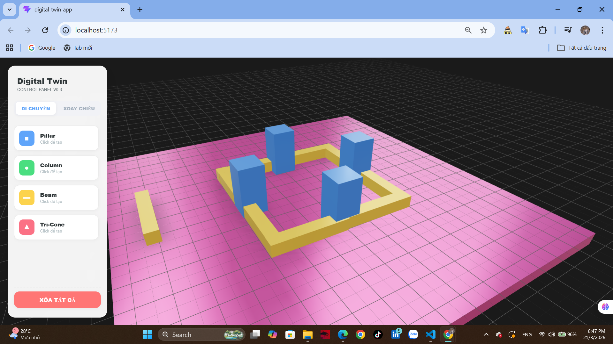

# 🏗️ Digital Twin App - Construction Editor

Dự án mô phỏng không gian số - thử nghiệm (Digital Twin - test) hỗ trợ biên soạn và quản lý các cấu kiện xây dựng trong môi trường 3D tương tác thời gian thực.

-----

## 🛠️ Công nghệ & Thư viện sử dụng

| Thư viện | Vai trò |
| :--- | :--- |
| **React + Vite** | Framework chính, tối ưu tốc độ phản hồi HMR. |
| **Three.js** | Core engine xử lý đồ họa WebGL. |
| **@react-three/fiber** | Cầu nối giúp viết Three.js bằng cú pháp React. |
| **@react-three/drei** | Thư viện bổ trợ (Grid, TransformControls, Environment). |
| **Zustand** | Quản lý trạng thái (State Management) tập trung cho toàn bộ cấu kiện. |

-----

## 💡 Các phương pháp & Chức năng chính

### 1\. Quản lý dữ liệu tập trung (Zustand Store)

Toàn bộ thông tin về vị trí (`position`), góc xoay (`rotation`), và loại hình dạng (`geometry`) được lưu trữ trong một Store duy nhất. Điều này giúp đồng bộ dữ liệu giữa bảng điều khiển UI 2D và không gian 3D.

### 2\. Tương tác vật thể (Transform Gizmo)

Sử dụng phương pháp **TransformControls** để cung cấp các mũi tên điều hướng. Người dùng có thể:

  * **Move Mode:** Di chuyển khối tự do trên mặt phẳng.
  * **Rotate Mode:** Xoay khối theo các trục X, Y, Z để điều chỉnh hướng cấu kiện.

### 3\. Thuật toán cố định cao độ (Grounding Logic)

Để tránh tình trạng vật thể bị "lún" xuống sàn hoặc bay lơ lửng, hệ thống tự động tính toán lại tọa độ $Y$ dựa trên chiều cao của khối:

<div align="center">

# $$\mathbf{y = \frac{height}{2}}$$

</div>

Điều này đảm bảo đáy của cấu kiện luôn tiếp xúc chính xác với mặt sàn $y=0$.

-----

## 🚀 Hướng dẫn Cài đặt & Khởi chạy

Nếu bạn vừa pull dự án này từ Git về hoặc thiếu thư viện, hãy thực hiện các bước sau:

### 1\. Tải về và Cài đặt thư viện

Mở Terminal tại thư mục dự án và chạy lệnh để tải toàn bộ các gói phụ thuộc (dependencies) trong file `package.json`:

```bash
npm install
```

### 2\. Chạy môi trường Phát triển

Sau khi cài đặt xong, khởi chạy server local để xem giao diện:

```bash
npm run dev
```

Sau đó, truy cập địa chỉ: `http://localhost:5173` trên trình duyệt.

### 3\. Lưu ý khi làm việc với Git

  * Chỉ cần chạy lại `npm install` sau khi `git pull`.
  

-----

## 🎹 Phím tắt thao tác (Roadmap)

  * **G**: Chuyển sang chế độ Di chuyển (Grab/Move).
  * **R**: Chuyển sang chế độ Xoay (Rotate).
  * **Delete**: Xóa cấu kiện đang chọn.